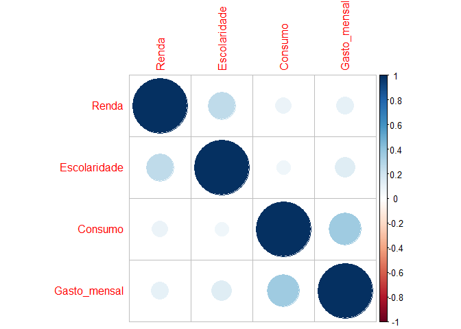
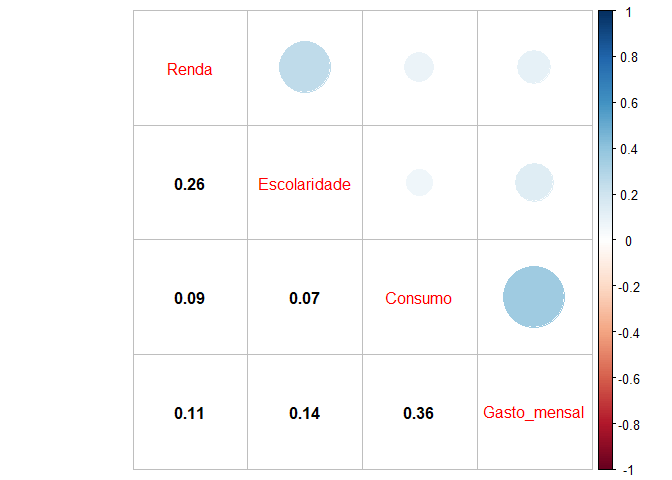

<!-- README.md is generated from README.Rmd. Please edit that file -->

# lais\_engler-lizandra

## Análise dos dados de consumo de ovos de galinha (2020)

### Carregando os pacotes

``` r
library(readxl)
library(tidyverse)
library(janitor)
library(forcats)
source("r/my-function.R")
library(corrplot)
```

### Entrendo com o banco de dados

``` r
dados <- read_excel("data/dados_ovos_consumo.xlsx") |> 
  janitor::clean_names()
names(dados)
#>  [1] "carimbo_de_data_hora"                                                                                                                                                                                                                        
#>  [2] "idade"                                                                                                                                                                                                                                       
#>  [3] "genero"                                                                                                                                                                                                                                      
#>  [4] "cidade"                                                                                                                                                                                                                                      
#>  [5] "renda"                                                                                                                                                                                                                                       
#>  [6] "nivel_de_escolaridade"                                                                                                                                                                                                                       
#>  [7] "qual_a_frequencia_do_seu_consumo_de_ovos"                                                                                                                                                                                                    
#>  [8] "no_momento_de_escolher_um_ovo_o_que_voce_leva_em_consideracao"                                                                                                                                                                               
#>  [9] "em_relacao_a_aparencia_qualidade_dos_ovos_no_momento_da_compra_o_que_voce_leva_em_consideracao"                                                                                                                                              
#> [10] "voce_tem_preferencia_por_ovos_com_gema"                                                                                                                                                                                                      
#> [11] "voce_sabe_quais_doencas_sao_transmitidas_pelos_ovos"                                                                                                                                                                                         
#> [12] "se_a_resposta_foi_sim_para_a_pergunta_anterior_voce_poderia_dar_exemplos"                                                                                                                                                                    
#> [13] "voce_consome_ovos_de_qual_sistema_de_criacao"                                                                                                                                                                                                
#> [14] "em_qual_momento_voce_consome_ovos"                                                                                                                                                                                                           
#> [15] "qual_formato_de_ovos_voce_consome"                                                                                                                                                                                                           
#> [16] "quanto_voce_gasta_mensalmente_com_a_compra_de_ovos"                                                                                                                                                                                          
#> [17] "voce_acha_que_o_ovo_deve_ser_refrigerado"                                                                                                                                                                                                    
#> [18] "voce_esta_disposto_a_pagar_mais_por_ovos_que_vem_de_sistemas_de_criacao_com_selo_de_bem_estar_o_bem_estar_visa_que_o_animal_expresse_seus_comportamentos_naturais_viva_em_ambiente_limpo_e_adequado_tenha_alimentacao_nutritiva_entre_outros"
#> [19] "voce_se_preocupa_com_o_impacto_ambiental_que_a_avicultura_de_postura_proporciona_poluicao_do_ar_solo_agua"
```

### Selecionar as variáveis para a análise

``` r
# Renda
dados$renda <- as_factor(dados$renda)
dados$renda |>  levels()
#> [1] "2 a 4 salários mínimos"       "Até 2 salários mínimos"      
#> [3] "4 a 10 salários mínimos"      "Acima de 20 salários mínimos"
#> [5] "10 a 20 salários mínimos"     "Não possuo renda fixa"
dados$renda <- lvls_reorder(dados$renda, c(6,2,1,3,5,4))
dados$renda |>  levels()
#> [1] "Não possuo renda fixa"        "Até 2 salários mínimos"      
#> [3] "2 a 4 salários mínimos"       "4 a 10 salários mínimos"     
#> [5] "10 a 20 salários mínimos"     "Acima de 20 salários mínimos"
# escolaridade
dados$nivel_de_escolaridade <- as_factor(dados$nivel_de_escolaridade)
dados$nivel_de_escolaridade |>  levels()
#> [1] "Graduação"                         "Pós-graduação"                    
#> [3] "Ensino Médio (1º ao 3º ano)"       "Ensino Fundamental (1º ao 9º ano)"
dados$nivel_de_escolaridade <- lvls_reorder(dados$nivel_de_escolaridade, c(4,3,1,2))
dados$nivel_de_escolaridade |>  levels()
#> [1] "Ensino Fundamental (1º ao 9º ano)" "Ensino Médio (1º ao 3º ano)"      
#> [3] "Graduação"                         "Pós-graduação"
#qual_a_frequencia_do_seu_consumo_de_ovos
dados$qual_a_frequencia_do_seu_consumo_de_ovos <- as_factor(dados$qual_a_frequencia_do_seu_consumo_de_ovos)
dados$qual_a_frequencia_do_seu_consumo_de_ovos |>  levels()
#> [1] "4 a 6 vezes na semana" "1 a 3 vezes na semana" "Não consumo ovos"     
#> [4] "Todos os dias"
dados$qual_a_frequencia_do_seu_consumo_de_ovos <- lvls_reorder(dados$qual_a_frequencia_do_seu_consumo_de_ovos, c(3, 2, 1, 4))
dados$qual_a_frequencia_do_seu_consumo_de_ovos |>  levels()
#> [1] "Não consumo ovos"      "1 a 3 vezes na semana" "4 a 6 vezes na semana"
#> [4] "Todos os dias"
#quanto_voce_gasta_mensalmente_com_a_compra_de_ovos
dados$quanto_voce_gasta_mensalmente_com_a_compra_de_ovos <- as_factor(dados$quanto_voce_gasta_mensalmente_com_a_compra_de_ovos)
dados$quanto_voce_gasta_mensalmente_com_a_compra_de_ovos |>  levels()
#> [1] "30.0"          "20.0"          "10.0"          "R$ 40 ou mais"
dados$quanto_voce_gasta_mensalmente_com_a_compra_de_ovos <- lvls_reorder(dados$quanto_voce_gasta_mensalmente_com_a_compra_de_ovos, c(3,2,1,4))
dados$quanto_voce_gasta_mensalmente_com_a_compra_de_ovos |>  levels()
#> [1] "10.0"          "20.0"          "30.0"          "R$ 40 ou mais"
#voce_sabe_quais_doencas_sao_transmitidas_pelos_ovos
dados$voce_sabe_quais_doencas_sao_transmitidas_pelos_ovos <- 
  dados$voce_sabe_quais_doencas_sao_transmitidas_pelos_ovos == "Sim"

#voce_acha_que_o_ovo_deve_ser_refrigerado
dados$voce_acha_que_o_ovo_deve_ser_refrigerado <- 
  dados$voce_acha_que_o_ovo_deve_ser_refrigerado == "Sim"

#voce_acha_que_o_ovo_deve_ser_refrigerado
dados$voce_esta_disposto_a_pagar_mais_por_ovos_que_vem_de_sistemas_de_criacao_com_selo_de_bem_estar_o_bem_estar_visa_que_o_animal_expresse_seus_comportamentos_naturais_viva_em_ambiente_limpo_e_adequado_tenha_alimentacao_nutritiva_entre_outros <- 
  dados$voce_esta_disposto_a_pagar_mais_por_ovos_que_vem_de_sistemas_de_criacao_com_selo_de_bem_estar_o_bem_estar_visa_que_o_animal_expresse_seus_comportamentos_naturais_viva_em_ambiente_limpo_e_adequado_tenha_alimentacao_nutritiva_entre_outros == "Sim"

#voce_se_preocupa_com_o_impacto_ambiental_que_a_avicultura_de_postura_proporciona_poluicao_do_ar_solo_agua
dados$voce_se_preocupa_com_o_impacto_ambiental_que_a_avicultura_de_postura_proporciona_poluicao_do_ar_solo_agua <- 
  dados$voce_se_preocupa_com_o_impacto_ambiental_que_a_avicultura_de_postura_proporciona_poluicao_do_ar_solo_agua == "Sim"
glimpse(dados)
#> Rows: 260
#> Columns: 19
#> $ carimbo_de_data_hora                                                                                                                                                                                                                         <dttm> ~
#> $ idade                                                                                                                                                                                                                                        <chr> ~
#> $ genero                                                                                                                                                                                                                                       <chr> ~
#> $ cidade                                                                                                                                                                                                                                       <chr> ~
#> $ renda                                                                                                                                                                                                                                        <fct> ~
#> $ nivel_de_escolaridade                                                                                                                                                                                                                        <fct> ~
#> $ qual_a_frequencia_do_seu_consumo_de_ovos                                                                                                                                                                                                     <fct> ~
#> $ no_momento_de_escolher_um_ovo_o_que_voce_leva_em_consideracao                                                                                                                                                                                <chr> ~
#> $ em_relacao_a_aparencia_qualidade_dos_ovos_no_momento_da_compra_o_que_voce_leva_em_consideracao                                                                                                                                               <chr> ~
#> $ voce_tem_preferencia_por_ovos_com_gema                                                                                                                                                                                                       <chr> ~
#> $ voce_sabe_quais_doencas_sao_transmitidas_pelos_ovos                                                                                                                                                                                          <lgl> ~
#> $ se_a_resposta_foi_sim_para_a_pergunta_anterior_voce_poderia_dar_exemplos                                                                                                                                                                     <chr> ~
#> $ voce_consome_ovos_de_qual_sistema_de_criacao                                                                                                                                                                                                 <chr> ~
#> $ em_qual_momento_voce_consome_ovos                                                                                                                                                                                                            <chr> ~
#> $ qual_formato_de_ovos_voce_consome                                                                                                                                                                                                            <chr> ~
#> $ quanto_voce_gasta_mensalmente_com_a_compra_de_ovos                                                                                                                                                                                           <fct> ~
#> $ voce_acha_que_o_ovo_deve_ser_refrigerado                                                                                                                                                                                                     <lgl> ~
#> $ voce_esta_disposto_a_pagar_mais_por_ovos_que_vem_de_sistemas_de_criacao_com_selo_de_bem_estar_o_bem_estar_visa_que_o_animal_expresse_seus_comportamentos_naturais_viva_em_ambiente_limpo_e_adequado_tenha_alimentacao_nutritiva_entre_outros <lgl> ~
#> $ voce_se_preocupa_com_o_impacto_ambiental_que_a_avicultura_de_postura_proporciona_poluicao_do_ar_solo_agua                                                                                                                                    <lgl> ~
```

## Extrair as variáveis

``` r
da <- dados[c(5, 6, 7, 16)]
names(da) <- c("Renda",
               "Escolaridade",
               "Consumo",
               "Gasto_mensal")
```

## 

``` r
da$Gasto_mensal   |>  levels()
#> [1] "10.0"          "20.0"          "30.0"          "R$ 40 ou mais"
da <- da |> 
  mutate(
    Renda = case_when(
      Renda=="Não possuo renda fixa" ~ 1,
      Renda=="Até 2 salários mínimos" ~2,
      Renda=="2 a 4 salários mínimos" ~ 3,
      Renda=="4 a 10 salários mínimos" ~ 4,
      Renda=="10 a 20 salários mínimos" ~ 5,
      Renda=="Acima de 20 salários mínimos" ~6
    ),
    
    Escolaridade = case_when(
      Escolaridade=="Ensino Fundamental (1º ao 9º ano)" ~ 1,
      Escolaridade=="Ensino Médio (1º ao 3º ano)" ~2,
      Escolaridade=="Graduação"   ~ 3,
      Escolaridade=="Pós-graduação" ~ 4
    ),
    
    Consumo = case_when(
      Consumo=="Não consumo ovos"  ~ 1,
      Consumo=="1 a 3 vezes na semana" ~2,
      Consumo=="4 a 6 vezes na semana"   ~ 3,
      Consumo=="Todos os dias"  ~ 4
    ),
    
    Gasto_mensal = case_when(
      Gasto_mensal=="10.0"   ~ 1,
      Gasto_mensal=="20.0"  ~2,
      Gasto_mensal=="30.0"   ~ 3,
      Gasto_mensal=="R$ 40 ou mais"  ~ 4
    )
  )
names(da)
#> [1] "Renda"        "Escolaridade" "Consumo"      "Gasto_mensal"
glimpse(da)
#> Rows: 260
#> Columns: 4
#> $ Renda        <dbl> 3, 2, 2, 4, 2, 4, 3, 3, 6, 2, 4, 3, 3, 2, 4, 4, 3, 5, 3, ~
#> $ Escolaridade <dbl> 3, 4, 3, 3, 3, 3, 2, 3, 3, 2, 3, 3, 3, 3, 3, 3, 3, 3, 3, ~
#> $ Consumo      <dbl> 3, 2, 2, 2, 2, 3, 2, 1, 2, 2, 2, 3, 2, 4, 2, 3, 4, 4, 3, ~
#> $ Gasto_mensal <dbl> 3, 2, 1, 1, 3, 4, 2, 2, 3, 3, 1, 3, 2, 3, 1, 3, 4, 4, 3, ~
mcor <- cor(da |>  drop_na())
corrplot(mcor)
```

<!-- -->

``` r
corrplot.mixed(mcor,lower = "number",lower.col = "black")
```

<!-- -->
